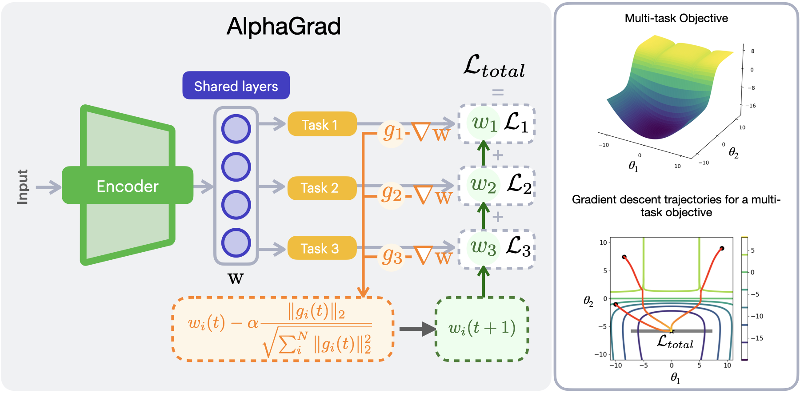
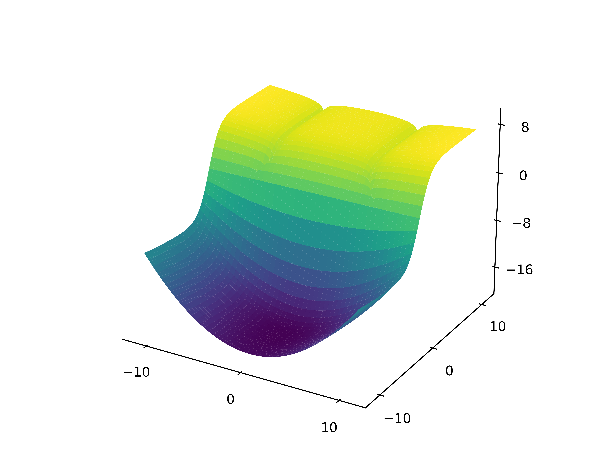

# AlphaGrad: Normalized Gradient Descent for Adaptive Multi-loss Functions in EEG-based Motor Imagery Classification

[](https://ieeexplore.ieee.org/document/11008918)

[](https://pytorch.org/get-started/previous-versions/)
[](https://alphagrad.github.io/static/pdf/Supplementary-material.pdf)



In this study, we propose AlphaGrad, a novel adaptive loss blending strategy for optimizing multi-task learning (MTL) models in motor imagery (MI)-based electroencephalography (EEG) classification. AlphaGrad is the first method to automatically adjust multi-loss functions with differing metric scales, including mean square error, cross-entropy, and deep metric learning, within the context of MI-EEG. We evaluate AlphaGrad using two state-of-the-art MTL-based neural networks, MIN2Net and FBMSNet, across four benchmark datasets. Experimental results show that AlphaGrad consistently outperforms existing strategies such as AdaMT, GradApprox, and fixed-weight baselines in classification accuracy and training stability. Compared to baseline static weighting, AlphaGrad achieves over 10% accuracy improvement on subject-independent MI tasks when evaluated on the largest benchmark dataset. Furthermore, AlphaGrad demonstrates robust adaptability across various EEG paradigms—including steady-state visually evoked potential (SSVEP) and event-related potential (ERP), making it broadly applicable to brain-computer interface (BCI) systems. We also provide gradient trajectory visualizations highlighting AlphaGrad’s ability to maintain training stability and avoid local minima. These findings underscore AlphaGrad’s promise as a general-purpose solution for adaptive multi-loss optimization in biomedical time-series learning.

## Trajectory of gradient descent (GD) for a multi-task objective

<div style="text-align: center; margin-bottom: 2em;">
  <h4>Multi-task Objective</h4>
  
</div>

<!-- First Row: Baseline + GradApprox -->
<div style="display: flex; justify-content: center; gap: 1.5em; margin-bottom: 2em;">
  <div style="text-align: center;">
    <h4>Baseline</h4>
    <video src="./static/videos/Fixed-video.mp4" autoplay muted loop playsinline height="150px"></video>
  </div>
  <div style="text-align: center;">
    <h4>GradApprox</h4>
    <video src="./static/videos/GradApprox-video.mp4" autoplay muted loop playsinline height="150px"></video>
  </div>
  <div style="text-align: center;">
    <h4>AdaMT</h4>
    <video src="./static/videos/AdaMT-video.mp4" autoplay muted loop playsinline height="150px"></video>
  </div>
  <div style="text-align: center;">
    <h4>AlphaGrad (ours)</h4>
    <video src="./static/videos/AlphaGrad-video.mp4" autoplay muted loop playsinline height="150px"></video>
  </div>
</div>


## Citation

To cited [our paper](https://ieeexplore.ieee.org/document/11008918)

R. Chaisaen, P. Autthasan, A. Ditthapron and T. Wilaiprasitporn, "AlphaGrad: Normalized Gradient Descent for Adaptive Multi-loss Functions in EEG-based Motor Imagery Classification," in IEEE Journal of Biomedical and Health Informatics, doi: 10.1109/JBHI.2025.3572197.

```
@ARTICLE{11008918,
  author={Chaisaen, Rattanaphon and Autthasan, Phairot and Ditthapron, Apiwat and Wilaiprasitporn, Theerawit},
  journal={IEEE Journal of Biomedical and Health Informatics}, 
  title={AlphaGrad: Normalized Gradient Descent for Adaptive Multi-loss Functions in EEG-based Motor Imagery Classification}, 
  year={2025},
  volume={},
  number={},
  pages={1-13},
  keywords={Electroencephalography;Training;Feature extraction;Measurement;Multitasking;Brain modeling;Adaptation models;Motors;Filter banks;Classification algorithms;Brain-computer interfaces;multi-task learning;adaptive loss blending;motor imagery EEG;normalized gradient descent},
  doi={10.1109/JBHI.2025.3572197}}
```